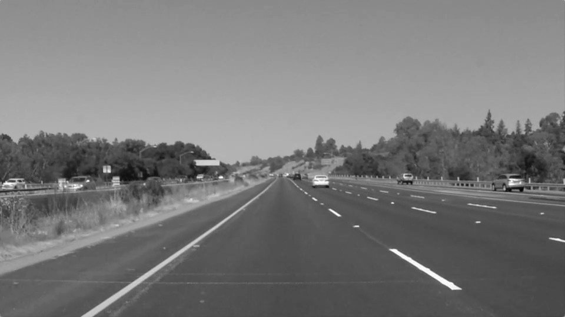

# **Finding Lane Lines on the Road**

## Writeup Template

### You can use this file as a template for your writeup if you want to submit it as a markdown file. But feel free to use some other method and submit a pdf if you prefer.

---

**Finding Lane Lines on the Road**

The goals / steps of this project are the following:
* Make a pipeline that finds lane lines on the road
* Reflect on your work in a written report

[//]: # (Image References)

[image1]: ./examples/grayscale.jpg "Grayscale"

---

### Reflection

### 1. Describe your pipeline. As part of the description, explain how you modified the draw_lines() function.

#### My pipeline consisted of 5 steps:

* First, I converted the images to grayscale to allow for edge detection

* Applied the gaussian blur filter before the canny function to remove noise that may arise from obtaining the edges
  

* Applying canny edge function (Contains Sobel operators) for edge detection with low side threshold of 50 and high side threshold of 150 yields:

* Masking the image and defining vertices within the bounds of image shape yields:

* Since using the normal rectangular slope to construct the lines may result to an infinity slope, I applied the Hough transform algorithm to obtain the slope. Subsequently, the line segments obtained were used by draw_all_lane_lines to extrapolate the full right and left lane lines. Some of the intuition behind the draw_all_lane_lines function were:

` > Obtaining the gradient after the hough transform was applied`
` > Picking gradients that falls between -0.4 and 0.4, thereby reducing the non-unity slope threshold allowed`
` > Determining the uniform slope and intercept of the new lines leading to extrapolation of the full left and right lane lines`

* Gradient estimated from Hough transform

* Original image with detected lane lines

### 2. Identify potential shortcomings with your current pipeline

Current implementation only detects straight lines and cannot detect curved lanes lines from far accurately. Also, it does not quickly detect smaller line segments (dashed or broken lines)

### 3. Suggest possible improvements to your pipeline

A potential improvement may be eliminating distortion and applying perspective transform  on the image. Poly fitting the lane lines instead of using the gradients of straight lines. Also, we could consider automatically estimating region of interest of all image shapes(lane lines) by integrating the Region of Proposal Network algorithm used by Faster R-CNN as part of the finding lane lines pipeline
